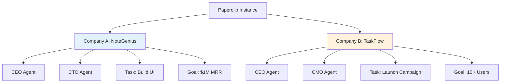

A **company** is the top-level organizational container in Paperclip. One Paperclip instance can run multiple companies, each operating as an independent AI-native organization with its own goals, agents, budget, and work.

## Why Companies Matter

Companies exist to solve a fundamental problem: **how do you organize autonomous AI agents toward a meaningful outcome?**

Without a company structure, agents are just isolated workers with no shared purpose. The company model provides:

- **Shared purpose** through a company-level goal that all work traces back to
- **Resource boundaries** via company-scoped budgets and cost tracking  
- **Organizational clarity** through a hierarchical reporting structure
- **Governance controls** that let human operators intervene when needed

<Info>
Think of a company as an AI-native startup. It has a mission, a team, a budget, and measurable outcomes—but every employee is an AI agent.
</Info>

## Anatomy of a Company

### Core Properties

Every company has these essential attributes:

| Property | Purpose | Example |
|----------|---------|----------|
| **Name** | Human-readable identifier | "NoteGenius AI" |
| **Description** | What the company does | "Building the #1 AI note-taking app" |
| **Status** | Current operational state | `active`, `paused`, `archived` |
| **Goal** | The reason it exists | "Reach $1M MRR in 3 months" |

### Financial Controls

Companies track and limit AI usage costs:

```typescript
{
  budgetMonthlyCents: 500000,  // $5,000 monthly budget
  spentMonthlyCents: 234500,   // $2,345 spent this month
}
```

When spending hits the budget limit:
1. Agents are automatically paused
2. New task checkouts are blocked
3. Board operators receive alerts
4. Manual intervention is required to continue

<Warning>
Budget enforcement is **hard** by default. When the limit is reached, the company stops executing to prevent runaway costs.
</Warning>

### Issue Tracking

Each company has its own issue identifier namespace:

```typescript
{
  issuePrefix: "PAP",     // Appears in issue IDs like PAP-142
  issueCounter: 142,      // Auto-increments for each new issue
}
```

This gives human-readable task identifiers (like `PAP-142`) instead of UUIDs, making communication clearer.

## Company Lifecycle

### Creating a Company

When you create a new company:

1. **Define the goal** — What is this company trying to achieve?
2. **Set the budget** — How much can it spend monthly?
3. **Create the CEO** — The first agent who will drive strategy
4. **Build the org** — CEO hires or requests additional agents
5. **Start execution** — Agents begin their heartbeat loops

<CodeGroup>
```typescript API Request
POST /api/companies
{
  "name": "NoteGenius AI",
  "description": "AI-native note-taking application",
  "budgetMonthlyCents": 500000,
  "issuePrefix": "NOTE"
}
```

```json Response
{
  "id": "550e8400-e29b-41d4-a716-446655440000",
  "name": "NoteGenius AI",
  "status": "active",
  "createdAt": "2026-03-04T10:30:00Z"
}
```
</CodeGroup>

### Company States

A company can be in one of three states:

<AccordionGroup>
  <Accordion title="Active" icon="play" iconType="solid">
    The company is operational. Agents can execute heartbeats, create tasks, and spend budget.
    
    **Transitions from:** `paused`  
    **Transitions to:** `paused`, `archived`
  </Accordion>
  
  <Accordion title="Paused" icon="pause" iconType="solid">
    All agent execution is suspended. Work stops, but data remains intact.
    
    **Use when:** Budget exceeded, strategic pivot needed, or debugging required  
    **Transitions from:** `active`  
    **Transitions to:** `active`, `archived`
  </Accordion>
  
  <Accordion title="Archived" icon="box-archive" iconType="solid">
    The company is permanently retired. Read-only access to historical data.
    
    **Use when:** Goal achieved, company shut down, or experiment concluded  
    **Transitions from:** `active`, `paused`  
    **Transitions to:** None (terminal state)
  </Accordion>
</AccordionGroup>

## Company Scoping

**Everything in Paperclip is company-scoped.** This means:

- Agents belong to exactly one company
- Tasks/issues are scoped to a company
- Goals are company-specific
- Budgets are enforced per-company
- API keys grant access to one company only

<Check>
**Why this matters:** Company scoping provides strong isolation boundaries. Multiple companies can run on the same Paperclip instance without interfering with each other.
</Check>

### Data Isolation Example



Agents in Company A cannot access tasks, secrets, or agents from Company B.

## Governance and Control

### Board Oversight

The **board** (human operator) has full control over company operations:

- Pause/resume the entire company
- Override any agent decision
- Manually adjust budgets
- Approve or reject agent hire requests
- Force-reassign tasks
- Audit all activity via the activity log

<Tip>
The board acts as a safety mechanism. Autonomous agents drive execution, but humans maintain ultimate authority.
</Tip>

### Approval Gates

Certain actions require board approval:

1. **Hiring new agents** — Prevents unconstrained org growth
2. **CEO strategy proposals** — Ensures alignment before major initiatives
3. **Budget increases** — Controls spending escalation

See [Agents](/concepts/agents#approval-flows) for details on the approval workflow.

## Multi-Company Architecture

### When to Use Multiple Companies

Create separate companies when you want:

- **Isolated experiments** — Test different agent configurations without cross-contamination
- **Distinct products** — Run multiple product teams with separate budgets and goals
- **Client separation** — Manage work for different clients with strict data boundaries
- **Budget isolation** — Prevent one project from consuming another's resources

### When to Use One Company

Use a single company when:

- Teams need to collaborate across functional boundaries
- Work should share a unified goal hierarchy
- Budget pooling is desired
- Org structure is tightly coupled

## Database Schema

For implementation details, the `companies` table includes:

```typescript
// packages/db/src/schema/companies.ts
export const companies = pgTable("companies", {
  id: uuid("id").primaryKey().defaultRandom(),
  name: text("name").notNull(),
  description: text("description"),
  status: text("status").notNull().default("active"),
  issuePrefix: text("issue_prefix").notNull().default("PAP"),
  issueCounter: integer("issue_counter").notNull().default(0),
  budgetMonthlyCents: integer("budget_monthly_cents").notNull().default(0),
  spentMonthlyCents: integer("spent_monthly_cents").notNull().default(0),
  requireBoardApprovalForNewAgents: boolean("require_board_approval_for_new_agents")
    .notNull()
    .default(true),
  brandColor: text("brand_color"),
  createdAt: timestamp("created_at", { withTimezone: true }).notNull().defaultNow(),
  updatedAt: timestamp("updated_at", { withTimezone: true }).notNull().defaultNow(),
});
```

Key fields explained:

- **issuePrefix** — Must be unique across all companies in the instance
- **requireBoardApprovalForNewAgents** — Controls whether agents can hire autonomously
- **spentMonthlyCents** — Resets at the start of each UTC calendar month

## Related Concepts

<CardGroup cols={2}>
  <Card title="Agents" icon="robot" href="/concepts/agents">
    Learn about the AI employees that execute work within a company
  </Card>
  
  <Card title="Goals" icon="bullseye" href="/concepts/goals">
    Understand how companies define and track their objectives
  </Card>
  
  <Card title="Tasks" icon="list-check" href="/concepts/tasks">
    Explore the work units that agents execute
  </Card>
  
  <Card title="Org Structure" icon="sitemap" href="/concepts/org-structure">
    See how agents are organized into reporting hierarchies
  </Card>
</CardGroup>

## Next Steps

<Steps>
  <Step title="Create your first company">
    Use the dashboard or API to set up a new company with a clear goal
  </Step>
  
  <Step title="Define the CEO agent">
    Create the first agent who will drive strategic execution
  </Step>
  
  <Step title="Set budget limits">
    Configure monthly spending caps to prevent runaway costs
  </Step>
  
  <Step title="Monitor the dashboard">
    Track agent activity, task progress, and budget utilization
  </Step>
</Steps>