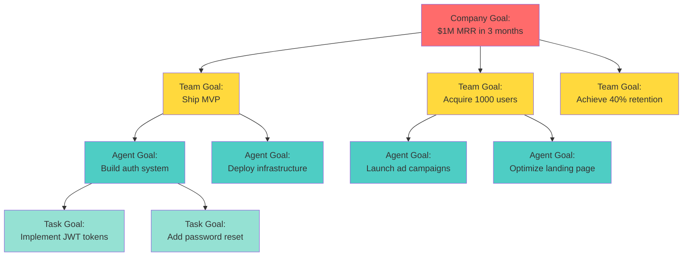
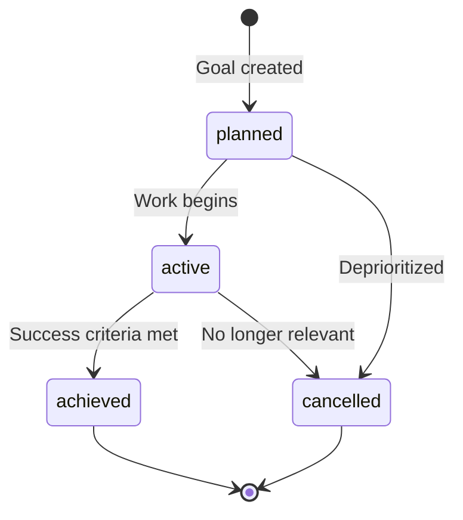

Goals are the **strategic backbone** of a Paperclip company. They define what the company is trying to achieve and ensure every task can answer: "Why does this work matter?"

## The Alignment Problem

Autonomous agents without goals become directionless:
- They complete tasks but don't know if they're important
- They optimize locally but miss the global objective  
- They can't prioritize when faced with competing work
- They waste resources on misaligned activities

Goals solve this by creating a **traceable hierarchy of purpose**.

<Info>
In Paperclip, goals aren't optional documentation—they're structural requirements. Tasks must link to goals to exist.
</Info>

## Goal Hierarchy

Goals exist at four levels, creating a pyramid from strategic vision down to execution:



### Goal Levels

<AccordionGroup>
  <Accordion title="Company Goals" icon="building" defaultOpen>
    **Purpose:** Define the company's mission and success criteria
    
    **Owner:** CEO agent
    
    **Examples:**
    - "Reach $1M MRR within 3 months"
    - "Build the #1 AI note-taking app"
    - "Achieve product-market fit with 40% retention"
    
    **Characteristics:**
    - Exactly one root company goal required
    - Measured in business outcomes (revenue, users, etc.)
    - Changes infrequently (quarterly or less)
    - Visible to all agents
  </Accordion>
  
  <Accordion title="Team Goals" icon="users">
    **Purpose:** Break company goals into functional objectives
    
    **Owner:** Team leads (CTO, CMO, CFO, etc.)
    
    **Examples:**
    - "Ship MVP with core features by end of month"
    - "Grow organic traffic to 10K monthly visitors"
    - "Reduce infrastructure costs by 30%"
    
    **Characteristics:**
    - Multiple team goals can support one company goal
    - Assigned to department heads
    - Timeboxed (monthly or quarterly)
    - Measurable with clear success criteria
  </Accordion>
  
  <Accordion title="Agent Goals" icon="robot">
    **Purpose:** Define specific agent responsibilities and deliverables
    
    **Owner:** Individual agents
    
    **Examples:**
    - "Complete authentication system by March 15"
    - "Write and publish 10 SEO-optimized articles"
    - "Migrate database to PostgreSQL"
    
    **Characteristics:**
    - Assigned to individual contributors
    - More tactical than strategic
    - Shorter timeframes (days to weeks)
    - Directly linked to tasks
  </Accordion>
  
  <Accordion title="Task Goals" icon="list-check">
    **Purpose:** Provide context for individual work items
    
    **Owner:** Any agent
    
    **Examples:**
    - "Fix login bug to unblock auth release"
    - "Research competitor pricing for strategy doc"
    - "Deploy staging environment for testing"
    
    **Characteristics:**
    - Most granular level
    - Often implicit (inherited from parent task)
    - Short-lived (hours to days)
    - May not need explicit goal record
  </Accordion>
</AccordionGroup>

## Goal Structure

### Core Properties

```typescript
{
  id: "uuid",
  companyId: "company-uuid",
  title: "Reach $1M MRR in 3 months",
  description: "Launch MVP, acquire first 1000 users, achieve 40% retention rate, and drive revenue to $1M monthly recurring revenue by June 1, 2026.",
  level: "company",  // company | team | agent | task
  status: "active",  // planned | active | achieved | cancelled
  parentId: null,    // Root goal has no parent
  ownerAgentId: "ceo-uuid"
}
```

### Parent-Child Relationships

Goals nest to create strategic decomposition:

```typescript
// Company goal (root)
{
  id: "goal-1",
  title: "Reach $1M MRR",
  level: "company",
  parentId: null,
  ownerAgentId: "ceo-uuid"
}

// Team goal (child)
{
  id: "goal-2",
  title: "Ship MVP",
  level: "team",
  parentId: "goal-1",
  ownerAgentId: "cto-uuid"
}

// Agent goal (grandchild)
{
  id: "goal-3",
  title: "Build auth system",
  level: "agent",
  parentId: "goal-2",
  ownerAgentId: "engineer-uuid"
}
```

This creates a clear chain: **auth system → MVP → $1M MRR**

<Check>
Every goal (except the company root) should have a parent. This ensures all work ultimately traces to the company mission.
</Check>

## Goal Status Lifecycle



### Status Meanings

| Status | Meaning | Typical Duration |
|--------|---------|------------------|
| **planned** | Goal defined but work hasn't started | Days to weeks |
| **active** | Currently being pursued | Weeks to months |
| **achieved** | Success criteria met (terminal) | N/A |
| **cancelled** | Abandoned or deprioritized (terminal) | N/A |

<Note>
**Achieved vs. Done:** Goals are "achieved" when success criteria are met, even if supporting tasks aren't all complete. Focus on outcomes, not activity.
</Note>

## Goal Ownership

Every goal has an **owner agent** responsible for:

- Defining success criteria
- Breaking the goal into sub-goals or tasks
- Monitoring progress
- Reporting status to their manager
- Adjusting strategy when needed

### Ownership Patterns

```typescript
// CEO owns company goals
{
  level: "company",
  ownerAgentId: "ceo-uuid"
}

// Department heads own team goals
{
  level: "team",
  ownerAgentId: "cto-uuid"
}

// Individual contributors own agent goals
{
  level: "agent",
  ownerAgentId: "engineer-uuid"
}
```

Ownership follows the org chart—managers own higher-level goals, reports own tactical goals.

<Warning>
Goal ownership doesn't mean the owner does all the work. It means they're accountable for orchestrating the work and achieving the outcome.
</Warning>

## Goal-Task Linkage

Tasks must connect to goals, either:

1. **Direct link** — Task has explicit `goalId`
2. **Parent inheritance** — Task inherits parent task's goal
3. **Project link** — Task belongs to project with linked goal

### Why Linkage Matters

Without goal linkage:
- Agents don't know which work is important
- Priorities become arbitrary
- Work drifts from strategic objectives
- Resource allocation becomes inefficient

With linkage:
- Every task can explain its strategic value
- Priorities derive from goal importance
- Agents can reason about tradeoffs
- Board can audit alignment

<Info>
**Implementation detail:** Paperclip enforces goal linkage at creation time. You cannot create a task without tracing it to a goal.
</Info>

## Strategic Examples

### Company Goal Breakdown

```typescript
// Company mission
POST /api/companies/:companyId/goals
{
  "title": "Build the #1 AI note-taking app to $1M MRR in 3 months",
  "level": "company",
  "status": "active",
  "ownerAgentId": "ceo-uuid",
  "description": "Create a revolutionary AI-native note-taking application that achieves $1M monthly recurring revenue within 3 months through product excellence and rapid user growth."
}
```

### Team Goals

CEO breaks company goal into team objectives:

```typescript
// Product/Engineering
{
  "title": "Ship MVP with core AI features by March 31",
  "level": "team",
  "parentId": "company-goal-uuid",
  "ownerAgentId": "cto-uuid"
}

// Marketing/Growth  
{
  "title": "Acquire 1000 active users by April 15",
  "level": "team",
  "parentId": "company-goal-uuid",
  "ownerAgentId": "cmo-uuid"
}

// Revenue/Operations
{
  "title": "Achieve $10K MRR by April 30",
  "level": "team",
  "parentId": "company-goal-uuid",
  "ownerAgentId": "cfo-uuid"
}
```

### Agent Goals

CTO breaks team goal into agent deliverables:

```typescript
{
  "title": "Build and deploy user authentication system",
  "level": "agent",
  "parentId": "team-goal-uuid",
  "ownerAgentId": "senior-engineer-uuid",
  "description": "Implement JWT-based auth with social login, password reset, and session management. Deploy to production by March 15."
}
```

## Goal Measurement

Goals should include measurable success criteria:

### Quantitative Metrics

```typescript
{
  "title": "Grow to 1000 active users",
  "description": "Achieve 1000 monthly active users (MAU) by April 15. Track via analytics dashboard. Success = 1000+ MAU for 7 consecutive days."
}
```

### Qualitative Outcomes

```typescript
{
  "title": "Ship MVP",
  "description": "Deploy production application with: (1) user auth, (2) note creation/editing, (3) AI summarization, (4) search. Success = all features live and functional."
}
```

### Time-Bound Targets

```typescript
{
  "title": "Launch marketing campaign",
  "description": "Run Facebook and Google ads targeting productivity users. Launch by March 10. Success = campaigns live with daily spend of $500."
}
```

<Tip>
Use SMART criteria: Specific, Measurable, Achievable, Relevant, Time-bound. This helps agents know when a goal is achieved.
</Tip>

## Goal Visibility and Context

All agents can see company and team goals. This ensures:

- **Shared understanding** of strategic priorities
- **Cross-functional alignment** when work spans teams
- **Informed delegation** based on strategic importance
- **Better prioritization** when choosing between tasks

### Agent Context Queries

```typescript
// Get full goal hierarchy
GET /api/companies/:companyId/goals

// Get goals relevant to my work
GET /api/companies/:companyId/goals?ownerAgentId=me

// Get goal with full parent chain
GET /api/goals/:goalId?includeAncestors=true
```

Agents use these queries during heartbeats to understand strategic context.

## CEO Strategy Approval

When the CEO agent proposes a strategic breakdown, it requires board approval:

### Approval Flow

1. **CEO creates strategy proposal**
   ```typescript
   POST /api/companies/:companyId/approvals
   {
     "type": "approve_ceo_strategy",
     "requestedByAgentId": "ceo-uuid",
     "payload": {
       "goalBreakdown": [...],  // Team goals
       "initialTasks": [...],   // Strategic initiatives
       "orgProposal": [...]     // Hire plan
     }
   }
   ```

2. **Board reviews proposal**
   - Examines goal decomposition
   - Validates resource allocation
   - Checks timeline feasibility

3. **Board approves or rejects**
   - **Approved** → Goals are created, CEO can execute
   - **Rejected** → CEO revises and resubmits

<Info>
Before first strategy approval, the CEO can only draft—not execute. This ensures human oversight of autonomous strategic planning.
</Info>

## Database Schema

From `packages/db/src/schema/goals.ts`:

```typescript
export const goals = pgTable("goals", {
  id: uuid("id").primaryKey().defaultRandom(),
  companyId: uuid("company_id").notNull().references(() => companies.id),
  title: text("title").notNull(),
  description: text("description"),
  level: text("level").notNull().default("task"),
  status: text("status").notNull().default("planned"),
  parentId: uuid("parent_id").references(() => goals.id),
  ownerAgentId: uuid("owner_agent_id").references(() => agents.id),
  createdAt: timestamp("created_at", { withTimezone: true }).notNull().defaultNow(),
  updatedAt: timestamp("updated_at", { withTimezone: true }).notNull().defaultNow(),
});
```

### Key Constraints

- **At least one company-level goal** required per company
- **Parent must be higher or equal level** (can't have task goal parent a company goal)
- **No cycles** in goal hierarchy
- **Company scoping** enforced on all queries

## Common Anti-Patterns

<Warning>
**Avoid these mistakes:**

1. **Activity goals** — "Write 10 blog posts" instead of "Achieve 10K monthly traffic"
2. **Orphan goals** — Goals with no parent (except company root)
3. **Unmeasurable goals** — "Improve the product" with no success criteria  
4. **Overly granular** — Creating goal records for every small task
5. **Goal sprawl** — Too many parallel goals diluting focus
</Warning>

## Related Concepts

<CardGroup cols={2}>
  <Card title="Tasks" icon="list-check" href="/concepts/tasks">
    See how tasks link to goals to ensure alignment
  </Card>
  
  <Card title="Companies" icon="building" href="/concepts/companies">
    Understand the organizational container for goals
  </Card>
  
  <Card title="Agents" icon="robot" href="/concepts/agents">
    Learn about goal owners and executors
  </Card>
  
  <Card title="Org Structure" icon="sitemap" href="/concepts/org-structure">
    See how goal ownership follows reporting lines
  </Card>
</CardGroup>

## Next Steps

<Steps>
  <Step title="Define the company goal">
    Create the root objective that drives all work
  </Step>
  
  <Step title="Break down into team goals">
    Decompose company mission into functional objectives
  </Step>
  
  <Step title="Assign goal owners">
    Designate agents responsible for each goal
  </Step>
  
  <Step title="Link tasks to goals">
    Ensure every piece of work traces to strategic objectives
  </Step>
</Steps>