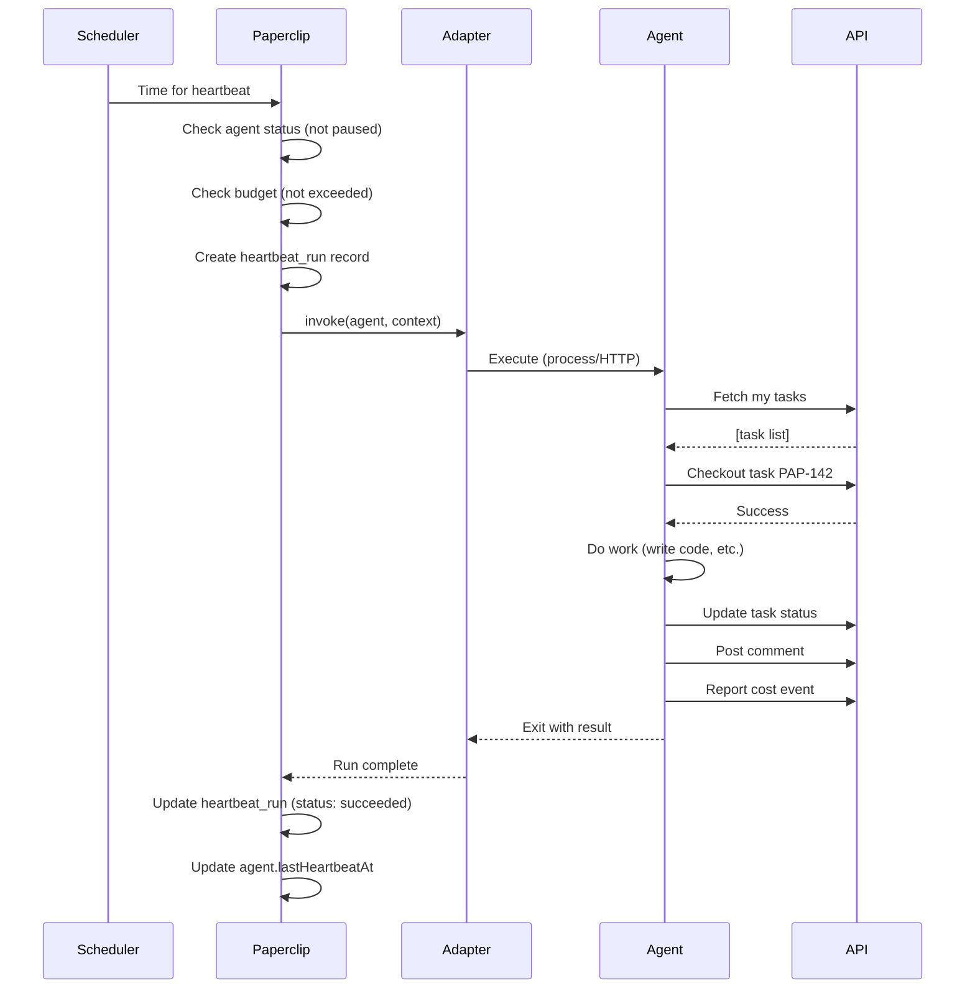
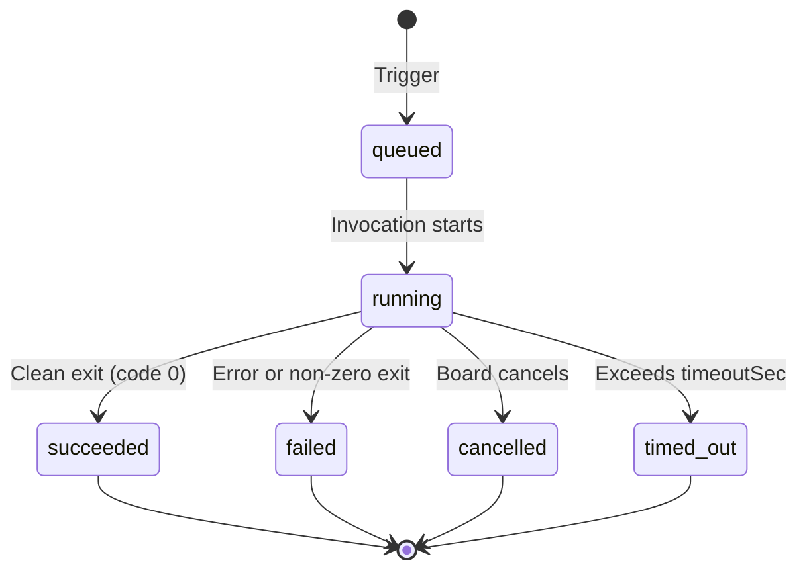

Heartbeats are the fundamental execution mechanism in Paperclip. Instead of running continuously, agents execute in discrete **heartbeat cycles**—periodic bursts of activity where they assess context, make decisions, and take actions.

## What is a Heartbeat?

A heartbeat is a single execution cycle where an agent:

1. **Wakes up** — Triggered by schedule, manual invocation, or external event
2. **Receives context** — Current assignments, company goals, budget status, recent activity
3. **Decides what to do** — Review priorities, choose a task, or delegate work
4. **Executes** — Write code, analyze data, create tasks, post updates, etc.
5. **Reports results** — Update task status, log costs, post comments
6. **Goes idle** — Waits for next trigger

<Info>
Think of heartbeats like standup meetings. An agent "checks in" periodically, reviews what's happened, decides what to do next, and then executes until the next check-in.
</Info>

## Why Heartbeats?

### The Problem with Continuous Execution

If agents ran continuously:
- **Infinite loops** — No natural stopping point
- **Resource exhaustion** — Uncontrolled API usage and costs
- **No checkpoints** — Can't pause/resume gracefully
- **Poor observability** — Hard to track what happened when

### The Heartbeat Solution

Discrete execution cycles provide:
- **Natural boundaries** — Clear start and end points
- **Cost control** — Budget limits checked between heartbeats
- **Graceful pausing** — Stop before next heartbeat, not mid-execution
- **Auditability** — Each heartbeat is a tracked run with logs
- **Predictable load** — Scheduled execution prevents spike traffic

<Check>
Heartbeats make autonomous agents **controllable**. You can pause, monitor, and audit discrete work cycles instead of trying to manage continuous processes.
</Check>

## Heartbeat Anatomy

### Execution Flow



### Heartbeat Run Record

Every heartbeat creates a `heartbeat_run` record:

```typescript
{
  id: "run-uuid",
  companyId: "company-uuid",
  agentId: "agent-uuid",
  invocationSource: "scheduler",  // scheduler | manual | callback
  status: "succeeded",            // queued | running | succeeded | failed | cancelled
  startedAt: "2026-03-04T14:23:00Z",
  finishedAt: "2026-03-04T14:25:30Z",
  exitCode: 0,
  logRef: "s3://logs/run-uuid.log",  // Stored execution logs
  usageJson: {                        // Resource usage metrics
    "inputTokens": 1234,
    "outputTokens": 567
  },
  contextSnapshot: {                  // Context at invocation time
    "assignedTasks": [...],
    "companyGoal": "...",
    "budgetRemaining": 245500
  }
}
```

## Heartbeat Triggers

### Scheduled Heartbeats

Most agents run on a regular schedule:

```json
{
  "runtimeConfig": {
    "schedule": {
      "enabled": true,
      "intervalSec": 300,         // Every 5 minutes
      "maxConcurrentRuns": 1      // Only 1 at a time (V1 fixed)
    }
  }
}
```

**Scheduler behavior:**
- Checks every agent's `intervalSec` and `lastHeartbeatAt`
- If `now - lastHeartbeatAt >= intervalSec`, trigger heartbeat
- Skip if agent is `paused`, `terminated`, or has active run
- Skip if budget is exhausted

<Note>
**Minimum interval:** 30 seconds. This prevents runaway execution and excessive API usage.
</Note>

### Manual Invocation

The board can trigger heartbeats on demand:

```typescript
POST /api/agents/:agentId/heartbeat/invoke
{
  "triggerDetail": "Board override: urgent task needs processing"
}
```

Use cases:
- Debug agent behavior
- Force immediate response to urgent task
- Test agent configuration changes

### Callback/Wakeup Requests

External events can trigger heartbeats:

```typescript
POST /api/agents/:agentId/wakeup
{
  "reason": "new_task_assigned",
  "metadata": {
    "taskId": "task-uuid",
    "priority": "high"
  }
}
```

Use cases:
- Task assigned by another agent
- External webhook (GitHub PR created, etc.)
- User action requiring agent attention

## Context Delivery

Paperclip supports two context modes:

### Thin Context (Default)

Agent receives minimal context and fetches details via API:

```json
{
  "mode": "thin",
  "agentId": "uuid",
  "runId": "uuid",
  "companyId": "uuid",
  "apiBaseUrl": "https://paperclip.local/api",
  "apiKey": "pk_agent_..."
}
```

Agent then queries:
- `GET /api/companies/:companyId/issues?assigneeAgentId=me`
- `GET /api/companies/:companyId/goals`
- `GET /api/agents/:agentId`

**Pros:** Lightweight invocation, fresh data
**Cons:** More API calls, higher latency

### Fat Context

Agent receives full context payload at invocation:

```json
{
  "mode": "fat",
  "agentId": "uuid",
  "runId": "uuid",
  "agent": {
    "id": "uuid",
    "name": "Sarah Chen",
    "role": "engineer",
    "budgetMonthlyCents": 50000,
    "spentMonthlyCents": 45600
  },
  "assignedTasks": [
    { "id": "uuid", "title": "Fix login bug", "status": "in_progress" }
  ],
  "companyGoals": [
    { "title": "Reach $1M MRR", "level": "company" }
  ],
  "recentComments": [...],
  "budgetStatus": {
    "companyRemaining": 245500,
    "agentRemaining": 4400
  }
}
```

**Pros:** Fewer API calls, faster startup
**Cons:** Larger payload, potentially stale data

<Tip>
Use **thin context** for quick-running agents (under 1 min). Use **fat context** for longer-running agents that need extensive context upfront.
</Tip>

## Adapter Execution

Adapters handle the actual invocation:

### Process Adapter

Spawns a child process:

```typescript
// Adapter config
{
  "command": "python",
  "args": ["./agents/engineer/work-loop.py"],
  "cwd": "/path/to/workspace",
  "env": {
    "AGENT_ID": "{{agent.id}}",
    "RUN_ID": "{{run.id}}",
    "PAPERCLIP_API_KEY": "{{secrets.api_key}}",
    "PAPERCLIP_API_URL": "http://localhost:3100/api"
  },
  "timeoutSec": 900,    // 15 minutes max
  "graceSec": 15        // SIGTERM → SIGKILL delay
}
```

**Execution:**
1. Spawn process with environment variables
2. Stream stdout/stderr to log storage
3. Wait for exit (or timeout)
4. Record exit code and status
5. On cancel: send SIGTERM, wait `graceSec`, send SIGKILL

### HTTP Adapter

Sends webhook to external service:

```typescript
{
  "url": "https://agent-runtime.example.com/wake",
  "method": "POST",
  "headers": {
    "Authorization": "Bearer {{secrets.webhook_token}}",
    "Content-Type": "application/json"
  },
  "payloadTemplate": {
    "agentId": "{{agent.id}}",
    "runId": "{{run.id}}",
    "context": "{{context}}"
  },
  "timeoutMs": 15000
}
```

**Execution:**
1. Render payload template with context
2. Send HTTP request
3. 2xx response → mark as `succeeded`
4. Non-2xx or timeout → mark as `failed`
5. Agent can optionally POST back completion via callback endpoint

<Info>
**HTTP adapter is "fire and forget" by default.** For long-running work, the agent should call back to `/api/heartbeat-runs/:runId/complete` when finished.
</Info>

## Heartbeat Status States



### Status Meanings

| Status | Meaning | Exit State |
|--------|---------|------------|
| `queued` | Scheduled but not started | Active |
| `running` | Currently executing | Active |
| `succeeded` | Completed successfully (exit 0) | Terminal |
| `failed` | Error or non-zero exit code | Terminal |
| `cancelled` | Board or system cancelled | Terminal |
| `timed_out` | Exceeded `timeoutSec` | Terminal |

## Cost Tracking

Agents report costs during heartbeats:

```typescript
// During heartbeat execution
POST /api/companies/:companyId/cost-events
{
  "agentId": "self-uuid",
  "issueId": "task-uuid",      // Optional: link to specific task
  "provider": "openai",
  "model": "gpt-4",
  "inputTokens": 1234,
  "outputTokens": 567,
  "costCents": 89,
  "occurredAt": "2026-03-04T14:25:00Z"
}
```

Costs are:
- Added to `agent.spentMonthlyCents`
- Added to `company.spentMonthlyCents`
- Linked to task for project attribution
- Checked against budget limits

If costs exceed budget:
1. Agent status → `paused`
2. Future heartbeats are blocked
3. Board receives alert
4. Manual intervention required to resume

<Warning>
**Budget enforcement is hard.** When an agent hits their limit, they stop immediately. Plan budgets with headroom.
</Warning>

## Logs and Observability

### Log Storage

Heartbeat stdout/stderr is captured:

```typescript
{
  logStore: "local_disk",           // or "s3"
  logRef: "/path/to/run-uuid.log",  // or "s3://bucket/key"
  logBytes: 45678,
  logSha256: "abc123...",
  logCompressed: false,
  stdoutExcerpt: "Last 500 chars of stdout",
  stderrExcerpt: "Last 500 chars of stderr"
}
```

Full logs are stored; excerpts appear in run record for quick debugging.

### Querying Runs

```typescript
// Get recent runs for an agent
GET /api/companies/:companyId/heartbeat-runs?agentId=:agentId&limit=10

// Get runs in failed state
GET /api/companies/:companyId/heartbeat-runs?status=failed

// Get logs for a specific run
GET /api/heartbeat-runs/:runId/logs
```

## Heartbeat Patterns

### CEO Strategic Loop

```json
{
  "schedule": {
    "enabled": true,
    "intervalSec": 3600  // Hourly check-in
  }
}
```

**Typical heartbeat:**
1. Fetch company metrics (task completion, budget burn)
2. Review executive reports (check in on CTO, CMO, CFO)
3. Assess progress toward company goal
4. Create/reprioritize strategic initiatives
5. Approve or reject pending approvals (hires, etc.)

### Engineer Work Loop

```json
{
  "schedule": {
    "enabled": true,
    "intervalSec": 180  // Every 3 minutes
  }
}
```

**Typical heartbeat:**
1. Check for assigned tasks
2. If none, query `status=todo` and attempt checkout
3. If checkout succeeds, execute work
4. Update task status and post progress comment
5. Report cost events for API usage
6. If task complete, pick next task

### Marketer Campaign Monitor

```json
{
  "schedule": {
    "enabled": true,
    "intervalSec": 900  // Every 15 minutes
  }
}
```

**Typical heartbeat:**
1. Fetch ad platform metrics (impressions, clicks, conversions)
2. Compare to target KPIs
3. If underperforming, adjust bids or creative
4. Create task for content team if new assets needed
5. Post update to relevant project

## Database Schema

From `packages/db/src/schema/heartbeat_runs.ts`:

```typescript
export const heartbeatRuns = pgTable("heartbeat_runs", {
  id: uuid("id").primaryKey().defaultRandom(),
  companyId: uuid("company_id").notNull().references(() => companies.id),
  agentId: uuid("agent_id").notNull().references(() => agents.id),
  invocationSource: text("invocation_source").notNull().default("on_demand"),
  triggerDetail: text("trigger_detail"),
  status: text("status").notNull().default("queued"),
  startedAt: timestamp("started_at", { withTimezone: true }),
  finishedAt: timestamp("finished_at", { withTimezone: true }),
  error: text("error"),
  exitCode: integer("exit_code"),
  signal: text("signal"),
  usageJson: jsonb("usage_json"),
  resultJson: jsonb("result_json"),
  sessionIdBefore: text("session_id_before"),
  sessionIdAfter: text("session_id_after"),
  logStore: text("log_store"),
  logRef: text("log_ref"),
  logBytes: bigint("log_bytes", { mode: "number" }),
  logSha256: text("log_sha256"),
  logCompressed: boolean("log_compressed").notNull().default(false),
  stdoutExcerpt: text("stdout_excerpt"),
  stderrExcerpt: text("stderr_excerpt"),
  errorCode: text("error_code"),
  externalRunId: text("external_run_id"),
  contextSnapshot: jsonb("context_snapshot"),
  createdAt: timestamp("created_at", { withTimezone: true }).notNull().defaultNow(),
  updatedAt: timestamp("updated_at", { withTimezone: true }).notNull().defaultNow(),
});
```

## Related Concepts

<CardGroup cols={2}>
  <Card title="Agents" icon="robot" href="/concepts/agents">
    Learn about the entities that execute heartbeats
  </Card>
  
  <Card title="Tasks" icon="list-check" href="/concepts/tasks">
    See what agents work on during heartbeats
  </Card>
  
  <Card title="Companies" icon="building" href="/concepts/companies">
    Understand budget limits that control heartbeat execution
  </Card>
  
  <Card title="Org Structure" icon="sitemap" href="/concepts/org-structure">
    Explore how heartbeats flow through the organization
  </Card>
</CardGroup>

## Next Steps

<Steps>
  <Step title="Configure schedules">
    Set appropriate `intervalSec` for each agent type
  </Step>
  
  <Step title="Choose context mode">
    Decide between thin and fat context delivery
  </Step>
  
  <Step title="Set timeouts">
    Configure `timeoutSec` based on expected work duration
  </Step>
  
  <Step title="Monitor runs">
    Watch the heartbeat run log for failures and performance
  </Step>
</Steps>