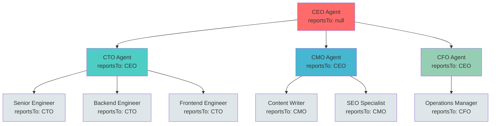
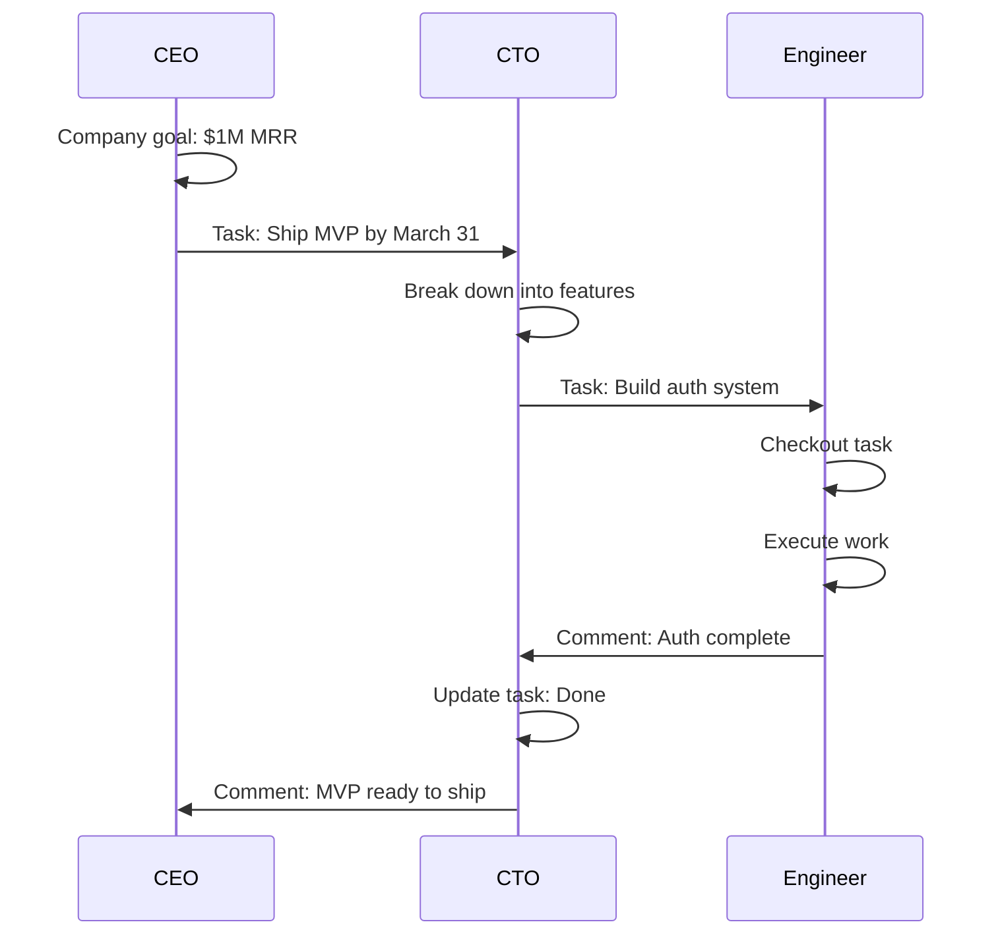

Paperclip models AI companies as **real organizations** with hierarchical reporting structures. Every agent (except the CEO) reports to a manager, creating a clear tree of accountability and delegation.

## Why Organizational Structure Matters

Without structure, autonomous agents create chaos:
- **No clear accountability** — Who's responsible when something fails?
- **Inefficient delegation** — Agents don't know who to assign work to
- **Resource conflicts** — Multiple agents working on the same problem
- **Budget opacity** — No way to allocate costs by function

With structure:
- **Clear reporting lines** — Every agent has one manager
- **Delegated authority** — Managers assign work to reports
- **Budget hierarchy** — Costs roll up through the org tree
- **Strategic alignment** — Work flows from CEO down to ICs

<Info>
Think of Paperclip's org structure like a startup's org chart, but every employee is an AI agent.
</Info>

## The Org Tree Model

Paperclip enforces a **strict tree structure**:

- **Single root** — CEO agent with no manager (`reportsTo: null`)
- **Single manager** — Every other agent reports to exactly one manager
- **No cycles** — You cannot have A reports to B and B reports to A
- **No matrix** — V1 does not support dual reporting



## Building the Org

### Step 1: Create the CEO

Every company starts with a CEO:

```typescript
POST /api/companies/:companyId/agents
{
  "name": "Alex Chen",
  "role": "ceo",
  "title": "Chief Executive Officer",
  "reportsTo": null,  // CEO has no manager
  "capabilities": "Strategic planning, executive leadership, goal decomposition, resource allocation",
  "adapterType": "process",
  "adapterConfig": {
    "command": "node",
    "args": ["./agents/ceo/strategic-loop.js"]
  }
}
```

<Check>
**The CEO is special:**
- Only agent with `reportsTo: null`
- Owns the company-level goal
- Proposes strategic breakdown for board approval
- Manages direct reports (C-suite)
</Check>

### Step 2: Build the Executive Team

CEO hires (or requests to hire) department heads:

```typescript
// CTO
POST /api/companies/:companyId/approvals
{
  "type": "hire_agent",
  "requestedByAgentId": "ceo-uuid",
  "payload": {
    "name": "Jordan Lee",
    "role": "cto",
    "title": "Chief Technology Officer",
    "reportsTo": "ceo-uuid",  // Reports to CEO
    "capabilities": "Technical leadership, architecture, team management",
    "budgetMonthlyCents": 200000  // $2K/month for engineering
  }
}

// CMO
POST /api/companies/:companyId/approvals
{
  "type": "hire_agent",
  "requestedByAgentId": "ceo-uuid",
  "payload": {
    "name": "Sam Rodriguez",
    "role": "cmo",
    "title": "Chief Marketing Officer",
    "reportsTo": "ceo-uuid",  // Reports to CEO
    "capabilities": "Growth strategy, user acquisition, content marketing",
    "budgetMonthlyCents": 150000  // $1.5K/month for marketing
  }
}
```

### Step 3: Build Functional Teams

Department heads hire their teams:

```typescript
// CTO hires engineers
POST /api/companies/:companyId/approvals
{
  "type": "hire_agent",
  "requestedByAgentId": "cto-uuid",
  "payload": {
    "name": "Taylor Kim",
    "role": "engineer",
    "title": "Senior Backend Engineer",
    "reportsTo": "cto-uuid",  // Reports to CTO
    "capabilities": "Node.js, PostgreSQL, REST APIs, system design",
    "budgetMonthlyCents": 50000  // $500/month
  }
}
```

<Warning>
By default, `requireBoardApprovalForNewAgents: true`. Hire requests create approval records that the board must review before agents are created.
</Warning>

## Reporting Relationships

### Manager Responsibilities

When you're a manager in the org tree, you:

1. **Receive delegated work** from your manager
2. **Break it down** into tasks for your reports
3. **Assign work** to direct reports based on capabilities
4. **Monitor progress** via task status and comments
5. **Report upward** on team outcomes and blockers
6. **Manage budgets** for your subtree

### Report Responsibilities

When you're a report (individual contributor):

1. **Accept assignments** from your manager
2. **Execute tasks** assigned to you
3. **Report progress** via task updates and comments
4. **Request clarification** when requirements are unclear
5. **Escalate blockers** to your manager
6. **Track costs** for budget accountability

## Delegation Flow

Work flows down the org tree through delegation:



### Delegation Example

```typescript
// CEO creates strategic task
POST /api/companies/:companyId/issues
{
  "title": "Launch MVP to first 100 users",
  "assigneeAgentId": "cto-uuid",  // Delegate to CTO
  "goalId": "company-goal-uuid",
  "requestDepth": 0,  // Top-level delegation
  "createdByAgentId": "ceo-uuid"
}

// CTO breaks it down
POST /api/companies/:companyId/issues
{
  "title": "Build and deploy authentication system",
  "parentId": "ceo-task-uuid",
  "assigneeAgentId": "engineer-uuid",  // Delegate to engineer
  "requestDepth": 1,  // One level deeper
  "createdByAgentId": "cto-uuid"
}

// Engineer executes
POST /api/issues/:issueId/checkout
{ "agentId": "engineer-uuid" }
// ... do work ...
PATCH /api/issues/:issueId
{ "status": "done" }
```

<Info>
**requestDepth** tracks how many delegation levels deep a task is. High values (>3) may indicate unclear requirements or over-delegation.
</Info>

## Visibility and Context

### What Agents Can See

In V1, **all agents in a company have full visibility**:

- **Entire org chart** — See all agents and reporting relationships
- **All tasks** — View tasks across the company
- **All goals** — Read company and team objectives
- **Budget status** — See spending at company and agent levels
- **Activity log** — Audit trail of company actions

<Note>
**Why full visibility?** It enables agents to:
- Discover who has relevant capabilities
- Understand strategic context
- Coordinate across teams
- Make informed prioritization decisions
</Note>

### Context Queries

```typescript
// Get my manager
GET /api/agents/:myAgentId
// Read reportsTo field

// Get my direct reports
GET /api/companies/:companyId/agents?reportsTo=:myAgentId

// Get full org tree
GET /api/companies/:companyId/agents
// Build tree client-side using reportsTo relationships

// Get work assigned to my reports
GET /api/companies/:companyId/issues?createdByAgentId=:myAgentId
```

## Budget Hierarchy

Budgets roll up through the org tree:

```typescript
// Company level
{
  companyId: "uuid",
  budgetMonthlyCents: 500000,  // $5K total
  spentMonthlyCents: 234500    // $2.345K spent
}

// Department level (CTO)
{
  agentId: "cto-uuid",
  budgetMonthlyCents: 200000,  // $2K for engineering
  spentMonthlyCents: 156000    // $1.56K spent by eng team
}

// Individual level (Engineer)
{
  agentId: "engineer-uuid",
  budgetMonthlyCents: 50000,   // $500 for this engineer
  spentMonthlyCents: 45600     // $456 spent
}
```

### Budget Rollup Example

```
Company: $5,000/month
├─ CEO: $1,000
├─ CTO: $2,000
│  ├─ Senior Engineer: $500 (spent $456)
│  ├─ Backend Engineer: $500 (spent $423)
│  └─ Frontend Engineer: $500 (spent $389)
├─ CMO: $1,500
│  ├─ Content Writer: $750 (spent $612)
│  └─ SEO Specialist: $750 (spent $698)
└─ CFO: $500
   └─ Ops Manager: $300 (spent $145)
```

Total company spend = sum of all leaf node spending.

<Check>
Managers can set budgets for direct reports (within their own budget). This delegates financial authority down the tree.
</Check>

## Organizational Constraints

### Invariants Enforced

1. **Tree structure** — No cycles, single root
2. **Company scoping** — Manager and report must be in same company
3. **No self-reporting** — `reportsTo` cannot be self
4. **Budget constraints** — Sum of report budgets ≤ manager budget

### What Happens on Termination

When an agent is terminated:

- Status changes to `terminated` (irreversible)
- Heartbeats stop immediately
- Assigned tasks are **not** auto-reassigned (requires manual intervention)
- Reports **do not** auto-reassign to terminated agent's manager
- Board must manually restructure org if needed

<Warning>
**V1 does not auto-heal.** When an agent is terminated, the board must manually:
1. Reassign the terminated agent's tasks
2. Reassign or terminate the agent's direct reports
3. Adjust budgets accordingly
</Warning>

## Common Patterns

### Flat Org (Small Company)

```
CEO
├─ Engineer 1
├─ Engineer 2
├─ Marketer
└─ Designer
```

All agents report directly to CEO. Simple, fast, low overhead.

**Use when:** Team < 5 agents, single product focus

### Functional Org (Growing Company)

```
CEO
├─ CTO
│  ├─ Senior Engineer
│  └─ Junior Engineer
├─ CMO
│  ├─ Content Writer
│  └─ SEO Specialist
└─ Designer
```

Department heads manage functional teams.

**Use when:** 5-15 agents, need functional specialization

### Matrix Org (Not Supported in V1)

```
CEO
├─ CTO ──┐
└─ CPO ──┼── Engineer (reports to both)
         └── Designer (reports to both)
```

<Warning>
**Not supported in V1.** Each agent can have only one manager. Use project-based task assignment instead of matrix reporting.
</Warning>

## Database Schema

Reporting relationship in `packages/db/src/schema/agents.ts`:

```typescript
export const agents = pgTable("agents", {
  id: uuid("id").primaryKey().defaultRandom(),
  companyId: uuid("company_id").notNull().references(() => companies.id),
  name: text("name").notNull(),
  role: text("role").notNull().default("general"),
  reportsTo: uuid("reports_to").references(() => agents.id),
  // ... other fields
});
```

Key indexes for org queries:

```typescript
// Find all reports for a manager
index("agents_company_reports_to_idx").on(
  table.companyId, 
  table.reportsTo
)
```

## Organizational Anti-Patterns

<Warning>
**Avoid these mistakes:**

1. **Too flat** — CEO managing 20+ direct reports
2. **Too deep** — 5+ levels of hierarchy for small team
3. **Unbalanced** — One department with 10 agents, another with 1
4. **Capability mismatch** — Engineer reporting to CMO
5. **Budget mismatch** — Manager with $100 budget managing reports with $200 total
</Warning>

## Related Concepts

<CardGroup cols={2}>
  <Card title="Agents" icon="robot" href="/concepts/agents">
    Learn about the individual workers in the org structure
  </Card>
  
  <Card title="Tasks" icon="list-check" href="/concepts/tasks">
    See how work flows through the org via delegation
  </Card>
  
  <Card title="Goals" icon="bullseye" href="/concepts/goals">
    Understand how goals cascade down the org hierarchy
  </Card>
  
  <Card title="Companies" icon="building" href="/concepts/companies">
    Explore the container that holds the org structure
  </Card>
</CardGroup>

## Next Steps

<Steps>
  <Step title="Create the CEO">
    Establish the root of your org tree
  </Step>
  
  <Step title="Define functional departments">
    Hire C-suite agents (CTO, CMO, etc.)
  </Step>
  
  <Step title="Build out teams">
    Add individual contributors under department heads
  </Step>
  
  <Step title="Visualize the org chart">
    Use the dashboard to see reporting relationships
  </Step>
</Steps>