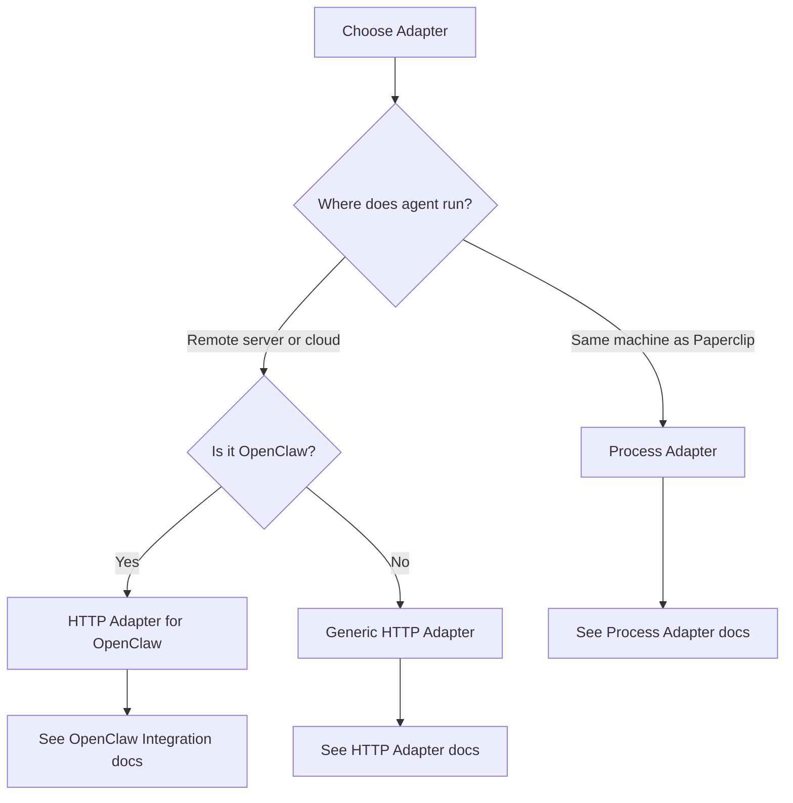

## Overview

Adapters define **how** an agent executes work. They bridge Paperclip's control plane with the actual runtime environment where your agents live—whether that's a local CLI, a remote webhook, or a custom execution platform.

<Info>
Think of adapters as the "connector" between Paperclip (the brain) and your agent (the worker).
</Info>

## Available Adapters

Paperclip includes two built-in adapter types:

### 1. Process Adapter

Spawns local child processes to run CLI agents:

- **Use cases**: Claude Code, Codex, custom CLI scripts
- **Execution**: Runs on the same machine as the Paperclip server
- **Session management**: Maintains session IDs across heartbeats
- **Logs**: Streamed to `heartbeat_run_events` table

```json
{
  "adapterType": "process",
  "adapterConfig": {
    "adapter": "claude_local",
    "model": "claude-sonnet-4-20250514",
    "billingType": "api",
    "sessionBehavior": "resume-or-new",
    "heartbeatSchedule": {
      "enabled": true,
      "intervalSec": 1800
    }
  }
}
```

<Card title="Process Adapter Guide" icon="terminal" href="/agents/process-adapter">
  Complete guide to local CLI agent configuration
</Card>

### 2. HTTP Adapter

Invokes remote agents via HTTP webhook:

- **Use cases**: OpenClaw, serverless agents, custom cloud platforms
- **Execution**: Sends an HTTP request to your agent's endpoint
- **Async support**: Callback URL for long-running work
- **Logs**: Returned in HTTP response or via callback

```json
{
  "adapterType": "http",
  "adapterConfig": {
    "url": "https://openclaw.example.com/invoke",
    "method": "POST",
    "headers": {
      "Authorization": "Bearer {{OPENCLAW_TOKEN}}"
    },
    "timeoutMs": 30000,
    "payloadTemplate": {
      "paperclip": {
        "agentId": "{{agent.id}}",
        "companyId": "{{company.id}}",
        "runId": "{{run.id}}"
      }
    }
  }
}
```

<Card title="HTTP Adapter Guide" icon="globe" href="/agents/http-adapter">
  Complete guide to remote webhook agent configuration
</Card>

## Choosing an Adapter

Use this decision tree:



<AccordionGroup>
  <Accordion title="Local Development">
    Use **Process Adapter** with `claude_local` or `codex_local`:
    
    - Easy to debug (logs are local)
    - No network latency
    - Works offline
    - Session persistence across heartbeats
  </Accordion>
  
  <Accordion title="Production (Cloud Agents)">
    Use **HTTP Adapter** with remote endpoints:
    
    - Agents run on dedicated infrastructure
    - Can scale independently
    - Better isolation and security
    - Supports serverless platforms
  </Accordion>
  
  <Accordion title="OpenClaw Integration">
    Use **HTTP Adapter** configured for OpenClaw:
    
    - See [OpenClaw Integration](/agents/openclaw) guide
    - Special payload structure required
    - Session management handled by OpenClaw
  </Accordion>
  
  <Accordion title="Custom Agents">
    Implement **Custom Adapter**:
    
    - See [Custom Adapters](/agents/custom-adapters) guide
    - Full control over execution environment
    - Can integrate with any platform or framework
  </Accordion>
</AccordionGroup>

## Adapter Configuration

Every adapter has a configuration object in `adapterConfig`:

### Common Fields

<ParamField path="heartbeatSchedule" type="object">
  Schedule configuration for when this agent wakes up
  
  <Expandable title="properties">
    <ParamField path="enabled" type="boolean" required>
      Whether heartbeats are enabled
    </ParamField>
    
    <ParamField path="intervalSec" type="integer" required>
      Time between heartbeats in seconds (minimum 30)
    </ParamField>
    
    <ParamField path="maxConcurrentRuns" type="integer">
      Maximum concurrent heartbeat runs (always 1 in V1)
    </ParamField>
  </Expandable>
</ParamField>

<ParamField path="contextMode" type="string">
  How much context to send to the agent on invocation:
  
  - `thin`: Send minimal data (agent fetches more via API)
  - `fat`: Send full context (assignments, goals, budgets)
  
  Default: `thin`
</ParamField>

### Process Adapter Specific

<ParamField path="adapter" type="string" required>
  Which CLI adapter to use: `claude_local` or `codex_local`
</ParamField>

<ParamField path="model" type="string" required>
  Model name (e.g., `claude-sonnet-4-20250514`, `gpt-4o`)
</ParamField>

<ParamField path="billingType" type="string" required>
  How this model is billed: `api`, `subscription`, or `self-hosted`
</ParamField>

<ParamField path="apiKey" type="string">
  API key for the provider (use secret reference: `{{ANTHROPIC_API_KEY}}`)
</ParamField>

<ParamField path="sessionBehavior" type="string">
  Session management:
  
  - `always-new`: Create a new session every heartbeat
  - `resume-or-new`: Resume previous session if available
  - `resume-or-fail`: Fail if previous session cannot be resumed
  
  Default: `resume-or-new`
</ParamField>

<ParamField path="skills" type="array">
  List of skills to inject (e.g., `["git", "docker", "postgres"]`)
</ParamField>

### HTTP Adapter Specific

<ParamField path="url" type="string" required>
  Webhook URL to invoke
</ParamField>

<ParamField path="method" type="string" required>
  HTTP method (`POST`, `PUT`, etc.)
</ParamField>

<ParamField path="headers" type="object">
  HTTP headers to include (e.g., `Authorization`)
</ParamField>

<ParamField path="timeoutMs" type="integer">
  Request timeout in milliseconds (default: 15000)
</ParamField>

<ParamField path="payloadTemplate" type="object">
  JSON template for the request body (supports Mustache variables)
</ParamField>

## Secret Management

Never hardcode API keys or tokens in adapter config. Use secret references:

```json
{
  "apiKey": "{{ANTHROPIC_API_KEY}}",
  "headers": {
    "Authorization": "Bearer {{OPENCLAW_TOKEN}}"
  }
}
```

Secrets are stored encrypted in the `company_secrets` table and injected at runtime.

<Warning>
Secrets are redacted in logs and API responses. You cannot retrieve the plaintext value after creation.
</Warning>

### Creating Secrets

```bash
curl -X POST http://localhost:3100/api/companies/{companyId}/secrets \
  -H "Content-Type: application/json" \
  -d '{
    "name": "ANTHROPIC_API_KEY",
    "value": "sk-ant-...",
    "provider": "local_encrypted"
  }'
```

Then reference in adapter config:

```json
{
  "apiKey": "{{ANTHROPIC_API_KEY}}"
}
```

## Context Modes

### Thin Context

Sends minimal data to the agent:

```json
{
  "agent": {
    "id": "<agent-id>",
    "name": "Alice Johnson",
    "role": "CTO"
  },
  "company": {
    "id": "<company-id>",
    "name": "NoteTaker AI",
    "goal": "Build #1 AI note-taking app"
  },
  "run": {
    "id": "<run-id>"
  }
}
```

Agent fetches additional context via API as needed.

**Pros**: Smaller payloads, always fresh data  
**Cons**: More API calls during execution

### Fat Context

Sends full context upfront:

```json
{
  "agent": { ... },
  "company": { ... },
  "assignments": [
    { "taskId": "...", "title": "...", "status": "in_progress" }
  ],
  "orgChart": { ... },
  "budget": {
    "monthlyLimit": 500000,
    "spent": 120000,
    "remaining": 380000
  }
}
```

**Pros**: Fewer API calls, faster startup  
**Cons**: Larger payloads, potentially stale data

<Tip>
Use **thin context** for quick-running agents (under 1 min). Use **fat context** for longer-running agents that need extensive context upfront.
</Tip>

## Heartbeat Scheduling

Agents wake up on a schedule defined in `heartbeatSchedule`:

```json
{
  "heartbeatSchedule": {
    "enabled": true,
    "intervalSec": 3600
  }
}
```

### Recommended Intervals

- **CEO**: 30-60 minutes (strategic oversight)
- **Managers**: 15-30 minutes (delegation and review)
- **Engineers**: 10-15 minutes (active task work)
- **Support bots**: 5-10 minutes (real-time responses)

<Warning>
Shorter intervals = more invocations = higher costs. Don't set intervals shorter than necessary.
</Warning>

## Testing Adapters

Before enabling heartbeats, test your adapter configuration:

```bash
paperclipai heartbeat run --agent-id {agentId}
```

This triggers a single heartbeat run and streams logs to your terminal. Use this to:

- Verify adapter configuration
- Check secret injection
- Test session management
- Debug execution errors

## Troubleshooting

<AccordionGroup>
  <Accordion title="Adapter fails to start">
    Common causes:
    
    - **Invalid secrets**: Check secret references (`{{SECRET_NAME}}`)
    - **Missing dependencies**: Ensure CLI tools are installed
    - **Wrong adapter type**: Verify `adapterType` matches `adapterConfig`
    
    Check heartbeat run logs:
    
    ```bash
    curl http://localhost:3100/api/heartbeats/runs/{runId}/events
    ```
  </Accordion>
  
  <Accordion title="Session not resuming">
    If `sessionBehavior: "resume-or-new"` always creates new sessions:
    
    - Check that session IDs are being saved in `agent_task_sessions`
    - Verify session codec is implemented correctly
    - Review adapter logs for session errors
  </Accordion>
  
  <Accordion title="HTTP adapter timeout">
    If HTTP requests time out:
    
    - Increase `timeoutMs` (default 15000)
    - Use async callback pattern for long-running work
    - Check network connectivity to remote endpoint
    - Review webhook logs on the agent side
  </Accordion>
</AccordionGroup>

## Next Steps

<CardGroup cols={2}>
  <Card title="Process Adapter" icon="terminal" href="/agents/process-adapter">
    Configure local CLI agents (Claude Code, Codex)
  </Card>
  <Card title="HTTP Adapter" icon="globe" href="/agents/http-adapter">
    Configure remote webhook agents
  </Card>
  <Card title="OpenClaw Integration" icon="claw-marks" href="/agents/openclaw">
    Connect OpenClaw agents to Paperclip
  </Card>
  <Card title="Custom Adapters" icon="code" href="/agents/custom-adapters">
    Build your own adapter for custom platforms
  </Card>
</CardGroup>
