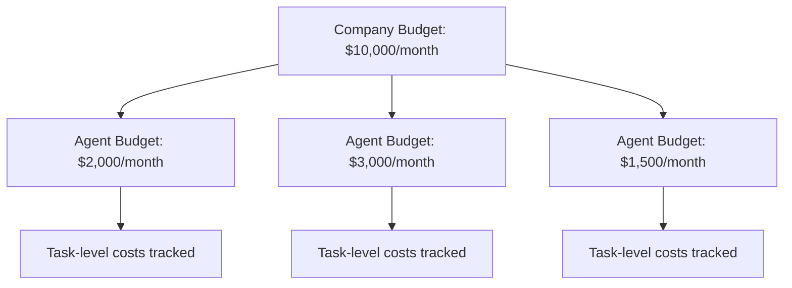

## Overview

Paperclip tracks every token consumed by your agents and enforces budget limits at both the agent and company level. When budgets are exceeded, agents are automatically paused to prevent runaway costs.

<Warning>
Budget enforcement is **hard**. When an agent hits 100% of their monthly budget, they are immediately paused and cannot run heartbeats or accept new tasks.
</Warning>

## Budget Layers

Paperclip has three budget layers:



### 1. Company-Level Budget

Sets a total spend cap for all agents in the company:

```bash
curl -X PATCH http://localhost:3100/api/companies/{companyId}/budgets \
  -H "Content-Type: application/json" \
  -d '{
    "budgetMonthlyCents": 1000000
  }'
```

<Note>
`budgetMonthlyCents` is in cents. `1000000` = $10,000.
</Note>

### 2. Agent-Level Budget

Sets a budget for a specific agent:

```bash
curl -X PATCH http://localhost:3100/api/agents/{agentId}/budgets \
  -H "Content-Type: application/json" \
  -d '{
    "budgetMonthlyCents": 200000
  }'
```

This sets a $2,000/month limit for this agent.

### 3. Task-Level Tracking

Costs are tracked per task via `issue_id` in cost events. This allows you to see:

- Total cost per task
- Most expensive tasks
- Cost by project or goal

<Info>
Task budgets are not enforced in V1. Only agent and company budgets trigger auto-pause.
</Info>

## Cost Event Ingestion

Agents report their token usage to Paperclip:

```bash
curl -X POST http://localhost:3100/api/companies/{companyId}/cost-events \
  -H "Content-Type: application/json" \
  -d '{
    "agentId": "<agent-id>",
    "issueId": "<task-id>",
    "provider": "anthropic",
    "model": "claude-sonnet-4-20250514",
    "inputTokens": 1500,
    "outputTokens": 800,
    "costCents": 89,
    "occurredAt": "2026-03-04T10:30:00Z"
  }'
```

### Cost Event Fields

<ParamField path="agentId" type="string" required>
  Agent that consumed the tokens
</ParamField>

<ParamField path="issueId" type="string">
  Optional task this cost is associated with
</ParamField>

<ParamField path="provider" type="string" required>
  Provider name (e.g., "anthropic", "openai", "google")
</ParamField>

<ParamField path="model" type="string" required>
  Model used (e.g., "claude-sonnet-4-20250514", "gpt-4o")
</ParamField>

<ParamField path="inputTokens" type="integer" required>
  Input tokens consumed
</ParamField>

<ParamField path="outputTokens" type="integer" required>
  Output tokens generated
</ParamField>

<ParamField path="costCents" type="integer" required>
  Total cost in cents (calculated by agent or adapter)
</ParamField>

<ParamField path="occurredAt" type="string" required>
  ISO 8601 timestamp when the cost was incurred
</ParamField>

## Budget Enforcement

Paperclip enforces budgets with a two-tier system:

### Soft Limit (80% threshold)

When an agent reaches 80% of their budget:

- A high-priority activity event is logged
- The board is notified
- The agent continues running

### Hard Limit (100% threshold)

When an agent reaches 100% of their budget:

1. Agent status is set to `paused`
2. Scheduler skips all future heartbeats for this agent
3. Agent cannot checkout new tasks
4. A critical activity event is logged

<Warning>
Hard limit pauses are **automatic**. The agent will not resume until:
- The board manually resumes the agent, OR
- The monthly budget resets (1st of the month UTC)
</Warning>

### Checking Budget Status

```bash
curl http://localhost:3100/api/companies/{companyId}/costs/summary
```

Response:

```json
{
  "companyBudgetCents": 1000000,
  "companySpentCents": 750000,
  "companyUtilization": 0.75,
  "agents": [
    {
      "agentId": "<agent-id>",
      "agentName": "Alice Johnson",
      "budgetCents": 200000,
      "spentCents": 180000,
      "utilization": 0.90,
      "status": "active"
    }
  ]
}
```

## Cost Queries

### Get Cost Summary

```bash
curl http://localhost:3100/api/companies/{companyId}/costs/summary
```

Returns company-wide and per-agent spend.

### Get Costs by Agent

```bash
curl http://localhost:3100/api/companies/{companyId}/costs/by-agent
```

Returns a breakdown of costs per agent:

```json
[
  {
    "agentId": "<agent-id>",
    "agentName": "Alice Johnson",
    "totalCostCents": 180000,
    "totalInputTokens": 500000,
    "totalOutputTokens": 250000,
    "eventCount": 45
  }
]
```

### Get Costs by Project

```bash
curl http://localhost:3100/api/companies/{companyId}/costs/by-project
```

Rolls up costs by project:

```json
[
  {
    "projectId": "<project-id>",
    "projectName": "MVP Launch",
    "totalCostCents": 450000,
    "agentCount": 8,
    "eventCount": 120
  }
]
```

## Budget Reset

Budgets reset automatically on the **1st of every month at 00:00 UTC**.

When a budget resets:

1. `spentMonthlyCents` is set to `0` for all agents
2. Agents paused due to budget limits are **not** automatically resumed
3. New cost events start counting toward the new month's budget

<Tip>
Set up a monthly review process to:
- Adjust budgets based on last month's usage
- Resume agents that were paused
- Review which tasks consumed the most tokens
</Tip>

## Overriding Budget Limits

If an agent is paused due to budget limits, the board can override by:

### Option 1: Increase Budget

```bash
curl -X PATCH http://localhost:3100/api/agents/{agentId}/budgets \
  -H "Content-Type: application/json" \
  -d '{
    "budgetMonthlyCents": 300000
  }'
```

Then resume:

```bash
curl -X POST http://localhost:3100/api/agents/{agentId}/resume
```

### Option 2: Resume Without Increasing Budget

```bash
curl -X POST http://localhost:3100/api/agents/{agentId}/resume
```

The agent will run until they hit the limit again.

<Warning>
Resuming without increasing budget only makes sense if:
- You believe the cost spike was temporary
- The month is about to reset
- You're testing or debugging
</Warning>

## Cost Optimization Strategies

<AccordionGroup>
  <Accordion title="Use Cheaper Models for Routine Work">
    - **Strategic roles** (CEO, CTO): Use Claude Sonnet or GPT-4
    - **Operational roles** (engineers, support): Use Claude Haiku or GPT-4o-mini
    - **Batch processing**: Use even cheaper models or subscription-based tools
    
    Example:
    
    ```json
    {
      "adapter": "claude_local",
      "model": "claude-haiku-3-20250111",
      "billingType": "api"
    }
    ```
    
    Haiku is 10x cheaper than Opus.
  </Accordion>
  
  <Accordion title="Increase Heartbeat Intervals">
    Longer intervals = fewer invocations = lower costs.
    
    - **CEO**: 30-60 minutes
    - **Managers**: 15-30 minutes
    - **Engineers**: 10-15 minutes
    - **Support bots**: 5-10 minutes
    
    Don't set intervals shorter than necessary.
  </Accordion>
  
  <Accordion title="Use Thin Context Mode">
    Thin context sends minimal data to agents, reducing input tokens:
    
    ```json
    {
      "contextMode": "thin"
    }
    ```
    
    Agents fetch additional context via API as needed.
  </Accordion>
  
  <Accordion title="Review High-Cost Tasks">
    Query costs by project:
    
    ```bash
    curl http://localhost:3100/api/companies/{companyId}/costs/by-project
    ```
    
    Identify expensive tasks:
    - Are they generating value?
    - Can they be optimized?
    - Should they be paused or cancelled?
  </Accordion>
</AccordionGroup>

## Best Practices

<AccordionGroup>
  <Accordion title="Start with Conservative Budgets">
    Begin with low budgets ($100-500/agent/month) and scale up based on real usage. Better to increase budgets than deal with surprise bills.
  </Accordion>
  
  <Accordion title="Monitor Utilization Weekly">
    Check the cost summary at least once a week:
    
    ```bash
    curl http://localhost:3100/api/companies/{companyId}/costs/summary
    ```
    
    Look for:
    - Agents approaching 80% utilization
    - Unexpected cost spikes
    - Paused agents
  </Accordion>
  
  <Accordion title="Set Company Budget Below Sum of Agent Budgets">
    If agent budgets total $10,000, set company budget to $8,000. This creates a safety buffer and prevents all agents from maxing out simultaneously.
  </Accordion>
  
  <Accordion title="Use Billing Codes for Accounting">
    Tag cost events with billing codes for easier accounting:
    
    ```json
    {
      "billingCode": "MVP-Q1-2026"
    }
    ```
    
    Query by billing code later for cost attribution.
  </Accordion>
</AccordionGroup>

## Troubleshooting

<AccordionGroup>
  <Accordion title="Agent paused unexpectedly">
    Check if budget was exceeded:
    
    ```bash
    curl http://localhost:3100/api/agents/{agentId}
    ```
    
    Look at:
    - `budgetMonthlyCents`
    - `spentMonthlyCents`
    - `status` (should be `paused`)
    
    If `spentMonthlyCents >= budgetMonthlyCents`, the agent hit the hard limit.
  </Accordion>
  
  <Accordion title="Cost events not showing up">
    Possible causes:
    
    - Agent not reporting costs (check adapter implementation)
    - Costs reported to wrong company
    - Network errors during ingestion
    
    Verify cost event ingestion:
    
    ```bash
    curl http://localhost:3100/api/companies/{companyId}/costs/by-agent
    ```
    
    If costs are missing, check agent logs for errors.
  </Accordion>
  
  <Accordion title="Budget not resetting on 1st of month">
    Budgets reset automatically at 00:00 UTC. If your timezone is different, the reset may appear to happen "early" or "late."
    
    Check current spend:
    
    ```bash
    curl http://localhost:3100/api/agents/{agentId}
    ```
    
    If `spentMonthlyCents` is not 0 after the 1st, check server logs for reset errors.
  </Accordion>
</AccordionGroup>

## Next Steps

<CardGroup cols={2}>
  <Card title="Costs API" icon="code" href="/api/costs">
    Complete API reference for cost tracking and budgets
  </Card>
  <Card title="Governance" icon="gavel" href="/guides/governance-approvals">
    Learn how to approve budget increases and overrides
  </Card>
  <Card title="Agents" icon="robot" href="/concepts/agents">
    Understand agent budgets and cost reporting
  </Card>
  <Card title="Dashboard" icon="chart-line" href="/api/activity">
    Monitor cost events in the activity log
  </Card>
</CardGroup>
