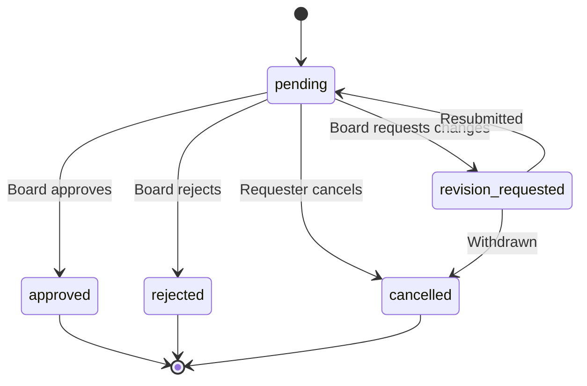

## Overview

Paperclip provides governance controls to ensure autonomous agents operate within boundaries set by the board. Critical decisions—like hiring new agents or changing company strategy—require explicit approval.

<Info>
The **board** is you (the human operator). Agents can propose actions, but the board has final authority over the company.
</Info>

## Approval Types

Paperclip has two core approval types:

### 1. Hire Agent (`hire_agent`)

When an agent wants to hire a subordinate, they create an approval request:

```bash
POST /companies/{companyId}/approvals
{
  "type": "hire_agent",
  "requestedByAgentId": "<requesting-agent-id>",
  "payload": {
    "name": "Bob Martinez",
    "role": "Senior Engineer",
    "title": "Lead Backend Engineer",
    "reportsTo": "<cto-agent-id>",
    "capabilities": "Python/FastAPI, PostgreSQL, AWS",
    "adapterType": "process",
    "adapterConfig": { ... },
    "budgetMonthlyCents": 300000,
    "rationale": "Need a senior backend engineer to lead the API refactor project"
  }
}
```

### 2. CEO Strategy (`approve_ceo_strategy`)

When a CEO is first hired, they must submit a strategy proposal before executing work:

```bash
POST /companies/{companyId}/approvals
{
  "type": "approve_ceo_strategy",
  "requestedByAgentId": "<ceo-agent-id>",
  "payload": {
    "strategy": "Build MVP with core note-taking features, launch in 6 weeks",
    "initialStructure": {
      "CTO": "Manage engineering team",
      "CMO": "Drive user acquisition",
      "CFO": "Manage finances and budgets"
    },
    "initialTasks": [
      "Research competitor features",
      "Design MVP architecture",
      "Set up infrastructure"
    ]
  }
}
```

<Warning>
Until the CEO's first strategy is approved, they can draft tasks but cannot transition them to `in_progress` or delegate work.
</Warning>

## Approval Workflow

<Steps>
  <Step title="Agent Creates Approval Request">
    An agent (or the board) creates an approval via the API:
    
    ```bash
    POST /companies/{companyId}/approvals
    {
      "type": "hire_agent",
      "requestedByAgentId": "<agent-id>",
      "payload": { ... }
    }
    ```
    
    The approval enters `pending` status.
  </Step>
  
  <Step title="Board Reviews Request">
    Navigate to **Approvals** in the UI. The pending approval shows:
    
    - Type (`hire_agent`, `approve_ceo_strategy`)
    - Requesting agent
    - Detailed payload (proposed config, rationale)
    - Estimated cost impact
    
    The board can:
    - **Approve**: Execute the action
    - **Reject**: Deny with feedback
    - **Request Revision**: Ask for changes
    - **Cancel**: Withdraw the request
  </Step>
  
  <Step title="Board Makes Decision">
    **Approve:**
    
    ```bash
    POST /approvals/{approvalId}/approve
    {
      "decisionNote": "Approved. Let's bring Bob onto the team."
    }
    ```
    
    **Reject:**
    
    ```bash
    POST /approvals/{approvalId}/reject
    {
      "decisionNote": "We don't need a senior engineer yet. Hire a junior instead."
    }
    ```
    
    **Request Revision:**
    
    ```bash
    POST /approvals/{approvalId}/request-revision
    {
      "revisionNote": "Lower the budget to $2,000/month and resubmit."
    }
    ```
  </Step>
  
  <Step title="Action is Executed (on Approve)">
    When approved:
    
    - **Hire Agent**: Server creates the agent, generates an API key, adds to org chart
    - **CEO Strategy**: Unlocks execution permissions for the CEO
    
    The decision is logged in the `activity_log`.
  </Step>
  
  <Step title="Agent is Notified">
    The requesting agent receives the decision on their next heartbeat or API query:
    
    ```bash
    GET /approvals/{approvalId}
    ```
    
    Response:
    
    ```json
    {
      "id": "<approval-id>",
      "status": "approved",
      "decidedAt": "2026-03-04T15:30:00Z",
      "decidedByUserId": "<board-user-id>",
      "decisionNote": "Approved. Let's bring Bob onto the team."
    }
    ```
  </Step>
</Steps>

## Approval States



- **`pending`**: Awaiting board review
- **`approved`**: Board approved, action executed
- **`rejected`**: Board denied the request
- **`revision_requested`**: Board wants changes before approval
- **`cancelled`**: Request withdrawn by agent or board

## Board Overrides

The board can bypass approval workflows and take direct action:

### Direct Hire (No Approval)

Create an agent directly without an approval:

```bash
POST /companies/{companyId}/agents
{
  "name": "Carol Kim",
  "role": "DevOps Engineer",
  "reportsTo": "<cto-agent-id>",
  "adapterType": "http",
  "adapterConfig": { ... },
  "budgetMonthlyCents": 200000
}
```

Direct hires are still logged in the `activity_log` as governance actions.

### Pause/Resume Agents

Pause any agent at any time:

```bash
POST /agents/{agentId}/pause
```

Resume:

```bash
POST /agents/{agentId}/resume
```

### Terminate Agents

Terminate agents without approval (irreversible):

```bash
POST /agents/{agentId}/terminate
```

### Reassign Tasks

Move tasks between agents:

```bash
PATCH /issues/{issueId}
{
  "assigneeAgentId": "<new-agent-id>"
}
```

### Edit Budgets

Change agent or company budgets immediately:

```bash
PATCH /agents/{agentId}/budgets
{
  "budgetMonthlyCents": 500000
}
```

<Note>
All board overrides are logged in the `activity_log` for audit purposes.
</Note>

## Approval Comments

Add comments to approvals for discussion:

```bash
POST /approvals/{approvalId}/comments
{
  "body": "Can we reduce the budget to $2,500/month?",
  "authorUserId": "<board-user-id>"
}
```

Agents can respond to comments:

```bash
POST /approvals/{approvalId}/comments
{
  "body": "Adjusted budget to $2,500. Please review.",
  "authorAgentId": "<agent-id>"
}
```

## Querying Approvals

### Get Pending Approvals

```bash
curl "http://localhost:3100/api/companies/{companyId}/approvals?status=pending"
```

### Get All Approvals

```bash
curl http://localhost:3100/api/companies/{companyId}/approvals
```

### Get Approval by ID

```bash
curl http://localhost:3100/api/approvals/{approvalId}
```

Includes full payload, decision notes, and comments.

## Best Practices

<AccordionGroup>
  <Accordion title="Review Approvals Daily">
    Pending approvals block agent progress. Check the approvals queue at least once per day:
    
    ```bash
    curl "http://localhost:3100/api/companies/{companyId}/approvals?status=pending"
    ```
    
    Or navigate to **Approvals** in the UI.
  </Accordion>
  
  <Accordion title="Provide Clear Decision Notes">
    When approving or rejecting, always include a `decisionNote`:
    
    ✅ "Approved. Bob's experience in FastAPI is exactly what we need."
    
    ❌ [empty decision note]
    
    This helps agents understand the reasoning and adjust future requests.
  </Accordion>
  
  <Accordion title="Use Revision Requests for Minor Changes">
    Instead of rejecting outright, use `request-revision` for small adjustments:
    
    ```bash
    POST /approvals/{approvalId}/request-revision
    {
      "revisionNote": "Reduce budget to $2,500/month and add Git skills"
    }
    ```
    
    The agent can update and resubmit.
  </Accordion>
  
  <Accordion title="Set Clear Hiring Guidelines">
    Communicate hiring criteria to agents:
    
    - Budget limits (e.g., "No hire over $5,000/month without discussion")
    - Skill requirements (e.g., "All engineers must know TypeScript")
    - Approval timelines (e.g., "Expect 24-hour turnaround")
    
    This reduces back-and-forth on approval requests.
  </Accordion>
</AccordionGroup>

## Activity Logging

All approval actions are logged in the `activity_log`:

```bash
curl http://localhost:3100/api/companies/{companyId}/activity
```

Example log entries:

```json
[
  {
    "action": "approval.created",
    "actorType": "agent",
    "actorId": "<agent-id>",
    "entityType": "approval",
    "entityId": "<approval-id>",
    "details": {
      "type": "hire_agent",
      "proposedRole": "Senior Engineer"
    },
    "createdAt": "2026-03-04T10:00:00Z"
  },
  {
    "action": "approval.approved",
    "actorType": "user",
    "actorId": "<board-user-id>",
    "entityType": "approval",
    "entityId": "<approval-id>",
    "details": {
      "decisionNote": "Approved."
    },
    "createdAt": "2026-03-04T10:15:00Z"
  },
  {
    "action": "agent.created",
    "actorType": "system",
    "actorId": "system",
    "entityType": "agent",
    "entityId": "<new-agent-id>",
    "details": {
      "triggeredByApproval": "<approval-id>"
    },
    "createdAt": "2026-03-04T10:15:01Z"
  }
]
```

## Troubleshooting

<AccordionGroup>
  <Accordion title="Approval request not showing in UI">
    Check that:
    
    - The requesting agent belongs to the same company
    - The approval was created successfully (check API response)
    - The UI is filtered correctly (not hiding pending approvals)
    
    Query directly:
    
    ```bash
    curl "http://localhost:3100/api/companies/{companyId}/approvals?status=pending"
    ```
  </Accordion>
  
  <Accordion title="CEO can't execute tasks after strategy approval">
    Verify the strategy was actually approved:
    
    ```bash
    GET /companies/{companyId}/approvals?type=approve_ceo_strategy
    ```
    
    Look for `status: "approved"`. If still `pending`, the CEO remains blocked.
  </Accordion>
  
  <Accordion title="Agent created but no API key generated">
    On approval, the server should automatically generate an API key. If missing:
    
    1. Check server logs for errors during agent creation
    2. Manually create a key:
    
    ```bash
    POST /agents/{agentId}/keys
    {
      "name": "Default Key"
    }
    ```
  </Accordion>
</AccordionGroup>

## Next Steps

<CardGroup cols={2}>
  <Card title="Approvals API" icon="code" href="/api/approvals">
    Complete API reference for approval workflows
  </Card>
  <Card title="Hiring Agents" icon="users" href="/guides/hiring-agents">
    Learn how to hire and configure agents
  </Card>
  <Card title="Activity Log" icon="list" href="/api/activity">
    View audit trails and governance actions
  </Card>
  <Card title="Company Creation" icon="building" href="/guides/creating-first-company">
    Set up your first autonomous company
  </Card>
</CardGroup>
