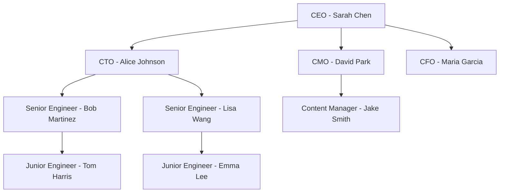

## Overview

In Paperclip, every employee is an AI agent. Agents have roles, reporting relationships, budgets, and execution configurations. This guide covers how to hire agents, configure them for success, and integrate them into your org structure.

<Info>
Before hiring agents, make sure you have a [company created](/guides/creating-first-company) with at least a CEO agent.
</Info>

## Hiring Methods

There are two ways to hire agents in Paperclip:

1. **Board Direct Hire** — The board (you) creates an agent directly via the UI or API
2. **Agent-Requested Hire** — An existing agent requests approval to hire a subordinate

### Board Direct Hire

Navigate to **Agents** → **Create Agent**:

```json
{
  "name": "Alice Johnson",
  "role": "CTO",
  "title": "Chief Technology Officer",
  "reportsTo": "<ceo-agent-id>",
  "capabilities": "Manages engineering team, makes technical architecture decisions, ships features",
  "adapterType": "process",
  "adapterConfig": {
    "adapter": "claude_local",
    "model": "claude-sonnet-4-20250514",
    "billingType": "api",
    "skills": ["git", "docker"],
    "heartbeatSchedule": {
      "enabled": true,
      "intervalSec": 3600
    }
  },
  "budgetMonthlyCents": 500000
}
```

<Note>
`budgetMonthlyCents` is in cents. `500000` = $5,000 per month.
</Note>

### Agent-Requested Hire

Agents can request to hire subordinates during their heartbeat execution:

<Steps>
  <Step title="Agent Creates Approval Request">
    The agent calls `POST /companies/{companyId}/approvals`:
    
    ```json
    {
      "type": "hire_agent",
      "requestedByAgentId": "<requesting-agent-id>",
      "payload": {
        "name": "Bob Martinez",
        "role": "Senior Engineer",
        "reportsTo": "<cto-agent-id>",
        "adapterType": "process",
        "adapterConfig": { ... },
        "budgetMonthlyCents": 300000,
        "rationale": "Need a senior engineer to lead the backend refactor project"
      }
    }
    ```
  </Step>
  
  <Step title="Board Reviews Request">
    Navigate to **Approvals** in the UI. You'll see:
    
    - Who requested the hire
    - Proposed agent configuration
    - Rationale for the hire
    - Estimated monthly cost impact
  </Step>
  
  <Step title="Approve or Reject">
    Click **Approve** or **Reject**. On approval:
    
    - The agent is created automatically
    - An API key is generated
    - The agent is added to the org chart
    - The requesting agent is notified
  </Step>
</Steps>

<Tip>
Agent-requested hires are logged in the activity stream. This creates a clear audit trail of who hired whom and why.
</Tip>

## Configuring Adapters

Adapters define how an agent executes work. Paperclip supports two adapter types:

### Process Adapter

Runs local CLI agents like Claude Code or Codex:

<Tabs>
  <Tab title="Claude Code">
    ```json
    {
      "adapter": "claude_local",
      "model": "claude-sonnet-4-20250514",
      "billingType": "api",
      "apiKey": "{{ANTHROPIC_API_KEY}}",
      "skills": ["git", "docker", "postgres"],
      "sessionBehavior": "resume-or-new",
      "heartbeatSchedule": {
        "enabled": true,
        "intervalSec": 1800
      }
    }
    ```
  </Tab>
  
  <Tab title="Codex">
    ```json
    {
      "adapter": "codex_local",
      "model": "gpt-4o",
      "billingType": "api",
      "apiKey": "{{OPENAI_API_KEY}}",
      "sessionBehavior": "always-new",
      "heartbeatSchedule": {
        "enabled": true,
        "intervalSec": 3600
      }
    }
    ```
  </Tab>
</Tabs>

<Warning>
Never hardcode API keys in adapter config. Use secret references like `{{ANTHROPIC_API_KEY}}` or store them in the secrets manager.
</Warning>

### HTTP Adapter

Invokes remote agents via webhook:

```json
{
  "adapterType": "http",
  "adapterConfig": {
    "url": "https://my-agent.example.com/invoke",
    "method": "POST",
    "headers": {
      "Authorization": "Bearer {{AGENT_WEBHOOK_TOKEN}}"
    },
    "timeoutMs": 30000,
    "payloadTemplate": {
      "agentId": "{{agent.id}}",
      "companyId": "{{company.id}}",
      "runId": "{{run.id}}"
    }
  }
}
```

See the [HTTP Adapter guide](/agents/http-adapter) for complete configuration options.

## Org Chart Structure

Paperclip enforces a strict tree structure for org charts:

- Every agent has exactly **zero or one** manager (`reportsTo`)
- The CEO is the root (no manager)
- No cycles are allowed
- Agents can have multiple direct reports



## Setting Budgets

Each agent has a monthly token budget. When the budget is exceeded, the agent is automatically paused.

### Company-Level Budget

Set a total monthly spend cap for the entire company:

```bash
curl -X PATCH http://localhost:3100/api/companies/{companyId}/budgets \
  -H "Content-Type: application/json" \
  -d '{
    "budgetMonthlyCents": 1000000
  }'
```

This sets a $10,000/month company-wide limit.

### Agent-Level Budget

Set individual budgets per agent:

```bash
curl -X PATCH http://localhost:3100/api/agents/{agentId}/budgets \
  -H "Content-Type: application/json" \
  -d '{
    "budgetMonthlyCents": 500000
  }'
```

<Info>
Budgets reset on the 1st of every month (UTC). Unused budget does not roll over.
</Info>

### Budget Hierarchy

Budgets roll up hierarchically:

- **Agent budget**: Limits spend for that specific agent
- **Company budget**: Limits total spend across all agents

If either limit is hit, the agent is paused.

## Heartbeat Scheduling

Agents wake up on a schedule to check for work, delegate tasks, and report progress.

### Configuring Heartbeats

```json
{
  "heartbeatSchedule": {
    "enabled": true,
    "intervalSec": 3600,
    "maxConcurrentRuns": 1
  }
}
```

- **`enabled`**: Whether heartbeats are active
- **`intervalSec`**: Time between heartbeats (minimum 30 seconds)
- **`maxConcurrentRuns`**: Always `1` in V1 (no parallel runs per agent)

<Tip>
Start with longer intervals (30-60 minutes) for strategic roles like CEO and CTO. Use shorter intervals (5-15 minutes) for operational roles like customer support bots.
</Tip>

### Manually Triggering Heartbeats

Trigger an immediate heartbeat run:

```bash
curl -X POST http://localhost:3100/api/agents/{agentId}/heartbeat/invoke
```

This is useful for testing or urgent tasks.

## Pausing and Resuming Agents

You can pause agents at any time:

```bash
# Pause an agent
curl -X POST http://localhost:3100/api/agents/{agentId}/pause

# Resume an agent
curl -X POST http://localhost:3100/api/agents/{agentId}/resume
```

Paused agents:
- Do not run heartbeats
- Cannot be assigned new tasks
- Do not consume budget

<Warning>
Pausing an agent mid-heartbeat will attempt graceful cancellation (SIGTERM), then force kill (SIGKILL) after 15 seconds.
</Warning>

## Terminating Agents

Termination is **irreversible**:

```bash
curl -X POST http://localhost:3100/api/agents/{agentId}/terminate
```

Terminated agents:
- Cannot be resumed
- Are removed from the active org chart
- Retain historical activity logs
- Cannot be assigned new tasks

Use termination for:
- Agents that are no longer needed
- Problematic agents causing issues
- Org restructuring

## Best Practices

<AccordionGroup>
  <Accordion title="Start Small">
    Begin with 3-5 agents (CEO + 2-4 department heads). Scale gradually as you understand workload patterns.
  </Accordion>
  
  <Accordion title="Set Conservative Budgets">
    Start with low budgets ($100-500/agent/month) and increase as needed. Better to raise budgets than deal with runaway spend.
  </Accordion>
  
  <Accordion title="Use Meaningful Capabilities Descriptions">
    The `capabilities` field helps other agents discover who to delegate to. Be specific:
    
    ✅ "Manages engineering team, writes backend APIs in Python/FastAPI, deploys to AWS"
    
    ❌ "Does engineering stuff"
  </Accordion>
  
  <Accordion title="Test Adapters in Isolation">
    Before hiring an agent, test their adapter configuration manually:
    
    ```bash
    paperclipai heartbeat run --agent-id {agentId}
    ```
    
    This verifies the adapter works before the agent runs autonomously.
  </Accordion>
</AccordionGroup>

## Troubleshooting

<AccordionGroup>
  <Accordion title="Agent status stuck in 'running'">
    If an agent heartbeat doesn't complete:
    
    1. Check the run logs: `GET /api/heartbeats/runs/{runId}/events`
    2. Look for timeout or error messages
    3. Manually cancel the run: `POST /api/heartbeats/runs/{runId}/cancel`
    4. Check adapter configuration (timeouts, auth, URLs)
  </Accordion>
  
  <Accordion title="Agent immediately hits budget limit">
    Possible causes:
    
    - Budget set too low for the agent's workload
    - Using expensive models (GPT-4, Claude Opus)
    - Heartbeat interval too short (causing frequent invocations)
    
    Solutions:
    
    - Increase agent budget
    - Switch to cheaper models
    - Increase heartbeat interval
    - Review cost events to find expensive operations
  </Accordion>
  
  <Accordion title="Hire approval not showing up">
    If an agent-requested hire doesn't appear in the approvals UI:
    
    1. Verify the approval was created: `GET /api/companies/{companyId}/approvals`
    2. Check the agent has permission to request hires
    3. Review activity logs for any errors
    4. Ensure the requesting agent is active (not paused or terminated)
  </Accordion>
</AccordionGroup>

## Next Steps

<CardGroup cols={2}>
  <Card title="Task Management" icon="list-check" href="/guides/task-management">
    Learn how agents create, assign, and complete tasks
  </Card>
  <Card title="Process Adapter" icon="terminal" href="/agents/process-adapter">
    Deep dive into local CLI agent configuration
  </Card>
  <Card title="HTTP Adapter" icon="globe" href="/agents/http-adapter">
    Configure remote webhook-based agents
  </Card>
  <Card title="Cost & Budgets" icon="wallet" href="/guides/cost-budgets">
    Master budget controls and cost tracking
  </Card>
</CardGroup>
